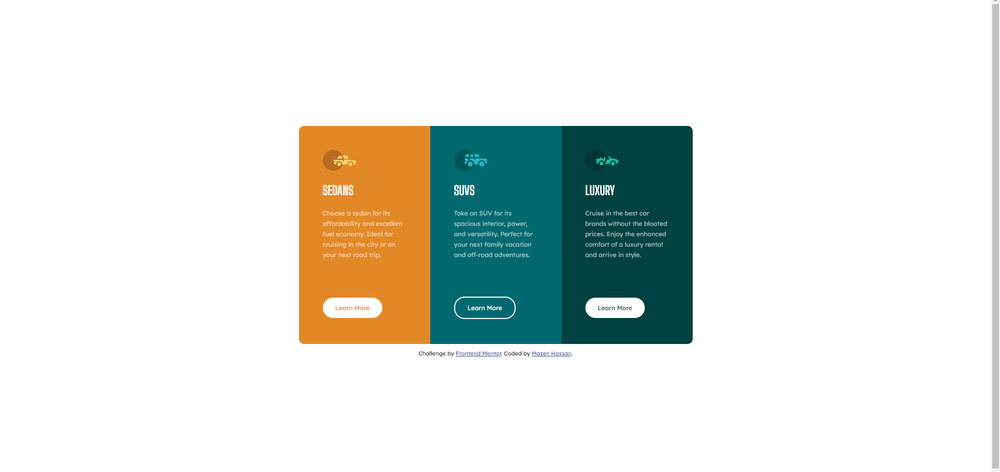

# Frontend Mentor - 3-column preview card component solution

This is a solution to the [3-column preview card component challenge on Frontend Mentor](https://www.frontendmentor.io/challenges/3column-preview-card-component-pH92eAR2-). Frontend Mentor challenges help you improve your coding skills by building realistic projects. 

## Table of contents

- [Frontend Mentor - 3-column preview card component solution](#frontend-mentor---3-column-preview-card-component-solution)
  - [Table of contents](#table-of-contents)
  - [Overview](#overview)
    - [The challenge](#the-challenge)
    - [Screenshot](#screenshot)
    - [Links](#links)
  - [My process](#my-process)
    - [Built with](#built-with)
    - [What I learned](#what-i-learned)
    - [Useful resources](#useful-resources)
  - [Acknowledgments](#acknowledgments)

**Note: Delete this note and update the table of contents based on what sections you keep.**

## Overview
In this challenge I worked on with flex display and used two types of flex-direction, column and row types. Each one of them were used for different resolution device purpose using mediaquery(@media) to define max and min width required to switch between.

### The challenge

Users should be able to:

- View the optimal layout depending on their device's screen size
- See hover states for interactive elements

### Screenshot




### Links

- Solution URL: 
- Live Site URL: https://mazz100.github.io/3-column-preview-card/

## My process
I started the challenge by assigning proper classes to content and wrapped every related content in a div tag to control the style in CSS code. 

Next I created CSS stylesheet and coded in the body element with:

- Flex display type with flex-direction and aligned content in the center with max viewport height ```100vh```.
- Font attributes like font-family, font-size, and font-weight.
- A general text color of white for all content inside of body.

Then I created css code for each class of content and also a shared class between them for shared styling.

Finally I implemented the mediaquery display for differet resolution display and finished by polishing borders radius and made the active state for links.

### Built with

- Semantic HTML5 markup
- CSS custom properties
- Flexbox
- CSS Grid
- Mobile-first workflow


### What I learned

- I learned to properly use flex direction and align content depending on need.
- Learned to use shared classes effectively for shared styling in css.

Overall I gained more confidence with the concept of display types and flex directions and how to use them.

I still have doubts to when we can use <main> element in CSS, I think its just a descriptive element for performance cases and accessibility.


```HTML
How I learned to combine two classes and have one for shared styling was very helpful and great to know although I am not sure if this is the best stracture to write it. 
<div class="sedans-content master-column">

<a class="sedans-link active-state" href="#"> Learn More</a>
```
```CSS
/* Some of the shared class styling used effectively. */

/*It was very useful and fun to share one class for the same styling used for them, and most importantly, it was more effective and clean. I am still open to every piece of feedback, and I am sure there are better ways to use it and take advantage of it.*/
.active-state:hover {
    color: white;
    background-color: transparent;
    border: white solid 2px;
}

.master-display {

    /* Content spacing */
    padding: 2.875rem;
    max-width: 10rem;
}

```

### Useful resources

- [Example resource 1](https://www.example.com) - This helped me for XYZ reason. I really liked this pattern and will use it going forward.
- [Example resource 2](https://www.example.com) - This is an amazing article which helped me finally understand XYZ. I'd recommend it to anyone still learning this concept.


## Acknowledgments

As usual, thanks a bunch for the super community and great support in teaching and helping with best code practice and advice without feeling bored or enough. I look forward to your continuous support.

